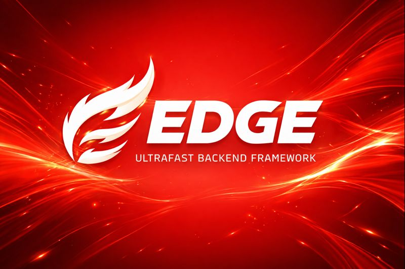

<p align="center">
  
</p>

<h1 align="center">Edge</h1>

<p align="center">
  A modular, high-performance backend framework built natively for Bun.
</p>

<p align="center">
  <strong>Explicit. Composable. Hot-swappable.</strong>
</p>

---

## What is Edge?

**Edge** is a modular backend framework designed for systems that must **evolve without downtime**.

It allows features to be **started, stopped, or replaced at runtime** , similar to Docker containers, but at the **application-logic level**.

Edge is inspired by NestJS architecture, rebuilt for Bun with:
- No decorators
- No reflection
- No runtime magic

---

## Core Principles

- **Modularity first** — features are isolated modules
- **Explicit APIs** — no hidden behavior
- **Startup compilation** — runtime stays fast
- **Framework as a kernel** — minimal, predictable core

---

## Key Features

- Modular architecture
- Deterministic dependency injection
- Controller-based routing
- Bun Fetch API HTTP layer
- Predictable request lifecycle
- Zero runtime reflection
- Hot-swappable modules (Docker-like behavior)

---

## Installation

```bash
bun add edge
